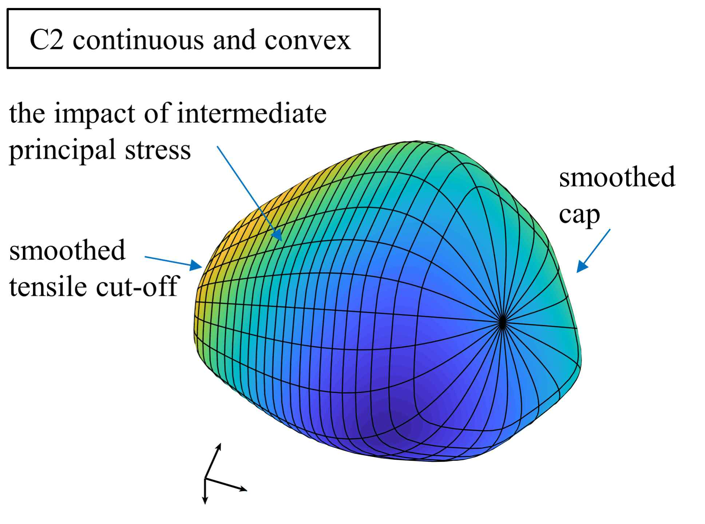
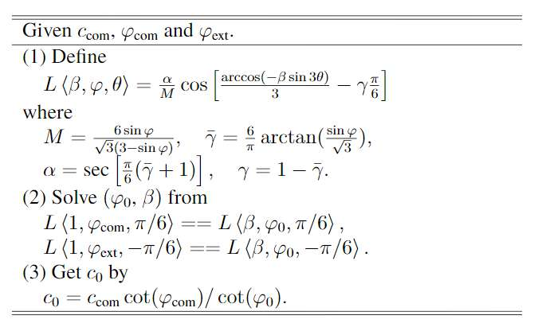

# Introduction

The **extended generalized classic yield function** (XGC) is convex and C2 continuous criterion. It can describe basic shear strength, tensile strength cut-off, compressive strength cap, and the impact of intermediate principal stress.

 
       
    

    Fig.1 the XGC yield surface in principal stress space
 

# Parameters

There are five parameters in XGC.

 are basic shear strength parameters. Their physical meanings are the cohesion and friction angle at the Lode angle .

 is a parameter for the impact of the intermediate principal stress. A larger  indicates a smaller impact, and  recovers to the MC criterion, where the shear strength only controlled by only the major and the minor principal stresses.
    
 represents the tensile strength. Its physical meaning is the maximum mean stress at the condition of zero deviatoric stress. (Note: tensile strength is always suggested, because it can avoid the singularities at )
    
 (or not valid) represents the compressive strength cap. Its physical meaning is the maximum negative mean stress at the condition of zero deviatoric stress. 
    
The yield function can also provide a close approximation to **MC criterion**, to avoid the issue of discontinuities gradients. In this case, the suggested parameters are . However, for most cases, a tensile strength  close to zero is more suitable for soils.

# Calibration
 and  are determined by their physical meanings.

 can be calibrated by 
triaxial compression and triaxial extension tests. 

- : the cohesion measured by triaxial compression test;
- : the friction angle measured by triaxial compression test;
- : the friction angle measured by triaxial extension test;

The algorithm is as below.

    

# Sample codes

[sub_EGC.m]: sub_EGC.m

The programming of yield value, gradient, and Hessian is provided in '[sub_EGC.m]' 